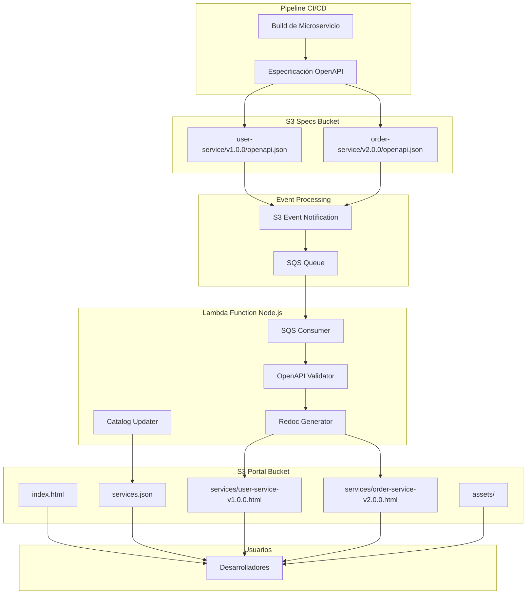

# Documento de Diseño: OpenAPI Documentation Viewer

## Resumen General

El OpenAPI Documentation Viewer es un sistema event-driven que genera automáticamente un Developer Portal centralizado mediante la agregación de especificaciones OpenAPI de múltiples microservicios. El sistema utiliza una arquitectura serverless basada en AWS Lambda, S3 y SQS para procesar y publicar documentación de forma incremental.

### Arquitectura Final

El sistema consta de los siguientes componentes principales:

1. **Pipeline de Publicación**: Los pipelines de CI/CD publican especificaciones OpenAPI a un bucket S3
2. **Event-Driven Processing**: S3 Event Notifications envían mensajes a una cola SQS cuando se publican nuevas especificaciones
3. **Lambda Processor (Node.js)**: Función Lambda que consume mensajes SQS, valida especificaciones, genera HTML usando Redoc, y actualiza el portal
4. **Portal Estático en S3**: Bucket S3 que aloja el sitio web estático con páginas de documentación generadas y un índice de servicios
5. **Herramienta CLI (Opcional)**: CLI para publicación manual y validación de especificaciones

### Decisiones Clave de Diseño

- **Lambda + Node.js**: Elegido porque Redoc (@redocly/openapi-core) es nativo de Node.js, proporcionando la mejor integración
- **Redoc para renderizado**: Utiliza la biblioteca @redocly/openapi-core para generar HTML standalone de alta calidad, eliminando la necesidad de templates personalizados
- **Event-driven con SQS**: Procesamiento asíncrono y desacoplado que escala automáticamente con el volumen de publicaciones
- **Regeneración incremental**: Solo regenera las especificaciones que cambian, no reconstruye todo el sitio
- **S3 para almacenamiento**: Almacenamiento duradero y escalable para especificaciones y HTML generado
- **Index page estático con datos dinámicos**: HTML estático que carga services.json dinámicamente para el catálogo
- **Enfoque en OpenAPI 3.x**: Soporte para especificaciones OpenAPI 3.0 y 3.1 usando bibliotecas de validación estándar


## Arquitectura

### Diagrama de Componentes



### Flujo de Datos

1. **Publicación**: Los pipelines de CI/CD publican especificaciones OpenAPI a S3 specs bucket (path: `{service-name}/{version}/openapi.json`)
2. **Event Notification**: S3 emite un evento cuando se crea/actualiza un objeto
3. **Queue**: El evento se envía a una cola SQS para procesamiento asíncrono
4. **Lambda Trigger**: Lambda se activa automáticamente al recibir mensajes en la cola
5. **Descarga**: Lambda descarga la especificación OpenAPI desde S3
6. **Validación**: Lambda valida el formato y conformidad con OpenAPI 3.0/3.1
7. **Generación con Redoc**: Lambda usa @redocly/openapi-core para generar HTML standalone
8. **Upload HTML**: Lambda sube el HTML generado al portal bucket (path: `services/{service-name}-{version}.html`)
9. **Actualización de Catálogo**: Lambda actualiza el archivo `services.json` con los metadatos del nuevo servicio
10. **Acceso**: Los usuarios acceden al portal vía S3 Static Website Hosting o CloudFront

### Estructura de S3

```
specs-bucket/
├── user-service/
│   ├── v1.0.0/
│   │   └── openapi.json
│   └── v1.1.0/
│       └── openapi.json
└── order-service/
    └── v2.0.0/
        └── openapi.json

portal-bucket/
├── index.html                          # Página de catálogo estática
├── services.json                       # Metadatos dinámicos de servicios
├── assets/
│   ├── search.js                       # Búsqueda del lado del cliente
│   └── styles.css                      # Estilos con Redoc CSS
└── services/
    ├── user-service-v1.0.0.html       # Página Redoc generada
    ├── user-service-v1.1.0.html
    └── order-service-v2.0.0.html
```


## Componentes e Interfaces

### 1. Herramienta CLI (Opcional)

La CLI proporciona comandos para publicar especificaciones manualmente y validar antes de publicar.

#### Interfaz de Comandos

```bash
# Publicar una especificación OpenAPI a S3
openapi-portal publish <spec-file> \
  --service-name <name> \
  --version <version> \
  --environment <env> \
  --commit <hash> \
  --bucket <s3-bucket>

# Validar una especificación sin publicar
openapi-portal validate <spec-file>

# Listar especificaciones publicadas
openapi-portal list \
  --bucket <s3-bucket> \
  --service <name>
```

#### Opciones de Configuración

```yaml
# openapi-portal.config.yml
aws:
  region: us-east-1
  specsBucket: my-openapi-specs
  portalBucket: my-developer-portal
  
validation:
  strict: true
  allowedVersions: ["3.0", "3.1"]
  
environments:
  - development
  - staging
  - production
```

### 2. Validador de OpenAPI

El validador asegura que las especificaciones cumplan con el estándar OpenAPI antes de procesarlas.

#### Interfaz del Validador

```typescript
interface OpenAPIValidator {
  validate(spec: object): ValidationResult;
  getSupportedVersions(): string[];
}

interface ValidationResult {
  valid: boolean;
  errors: ValidationError[];
  warnings: ValidationWarning[];
}

interface ValidationError {
  path: string;
  message: string;
  code: string;
}

interface ValidationWarning {
  path: string;
  message: string;
  suggestion?: string;
}
```

#### Reglas de Validación

- Verificar que la versión de OpenAPI sea 3.0.x o 3.1.x
- Validar que exista el campo `info` con `title` y `version`
- Verificar que `paths` esté definido y contenga al menos un endpoint
- Validar que todos los `$ref` apunten a definiciones existentes
- Verificar que los schemas tengan tipos válidos
- Validar que los códigos de respuesta sean válidos (100-599)

#### Implementación

```typescript
import SwaggerParser from '@apidevtools/swagger-parser';

class OpenAPIValidatorImpl implements OpenAPIValidator {
  async validate(spec: object): Promise<ValidationResult> {
    try {
      await SwaggerParser.validate(spec);
      return { valid: true, errors: [], warnings: [] };
    } catch (error) {
      return {
        valid: false,
        errors: this.parseValidationErrors(error),
        warnings: []
      };
    }
  }
  
  getSupportedVersions(): string[] {
    return ['3.0.0', '3.0.1', '3.0.2', '3.0.3', '3.1.0'];
  }
}
```


### 3. Buckets S3

#### Specs Bucket

Almacena las especificaciones OpenAPI publicadas por los pipelines.

**Estructura de Paths:**
- Pattern: `{service-name}/{version}/openapi.json`
- Ejemplo: `user-service/v1.0.0/openapi.json`

**Configuración:**
```json
{
  "versioning": "Enabled",
  "eventNotifications": [
    {
      "events": ["s3:ObjectCreated:*"],
      "destination": "sqs-queue-arn"
    }
  ]
}
```

#### Portal Bucket

Almacena el sitio web estático generado con las páginas de documentación.

**Configuración:**
```json
{
  "staticWebsiteHosting": {
    "enabled": true,
    "indexDocument": "index.html",
    "errorDocument": "error.html"
  },
  "publicAccess": true
}
```

### 4. Cola SQS

Recibe eventos de S3 y activa el procesamiento Lambda.

#### Configuración de la Cola

```json
{
  "queueName": "openapi-specs-queue",
  "visibilityTimeout": 300,
  "messageRetentionPeriod": 86400,
  "receiveMessageWaitTime": 20,
  "deadLetterQueue": {
    "targetArn": "dlq-arn",
    "maxReceiveCount": 3
  }
}
```

#### Formato de Mensaje

```json
{
  "Records": [
    {
      "eventName": "ObjectCreated:Put",
      "s3": {
        "bucket": {
          "name": "my-openapi-specs"
        },
        "object": {
          "key": "user-service/v1.0.0/openapi.json",
          "size": 12345,
          "eTag": "abc123"
        }
      }
    }
  ]
}
```


### 5. Función Lambda (Node.js)

La función Lambda es el componente central que procesa especificaciones OpenAPI y genera el portal.

#### Configuración de Lambda

```json
{
  "runtime": "nodejs18.x",
  "handler": "index.handler",
  "timeout": 300,
  "memorySize": 1024,
  "environment": {
    "SPECS_BUCKET": "my-openapi-specs",
    "PORTAL_BUCKET": "my-developer-portal",
    "REDOC_OPTIONS": "{\"theme\":{\"colors\":{\"primary\":{\"main\":\"#32329f\"}}}}"
  },
  "triggers": [
    {
      "type": "SQS",
      "queueArn": "sqs-queue-arn",
      "batchSize": 10
    }
  ]
}
```

#### Interfaz del Handler

```typescript
import { SQSEvent, SQSRecord, Context } from 'aws-lambda';
import { S3Client, GetObjectCommand, PutObjectCommand } from '@aws-sdk/client-s3';
import { bundle } from '@redocly/openapi-core';

interface LambdaHandler {
  handler(event: SQSEvent, context: Context): Promise<void>;
}

interface ProcessingResult {
  serviceName: string;
  version: string;
  success: boolean;
  error?: string;
  outputPath?: string;
}
```

#### Implementación del Handler

```typescript
export async function handler(event: SQSEvent, context: Context): Promise<void> {
  const results: ProcessingResult[] = [];
  
  for (const record of event.Records) {
    try {
      const result = await processRecord(record);
      results.push(result);
    } catch (error) {
      console.error('Error processing record:', error);
      results.push({
        serviceName: 'unknown',
        version: 'unknown',
        success: false,
        error: error.message
      });
    }
  }
  
  // Actualizar services.json con todos los resultados exitosos
  await updateServicesCatalog(results.filter(r => r.success));
  
  console.log('Processing complete:', JSON.stringify(results));
}

async function processRecord(record: SQSRecord): Promise<ProcessingResult> {
  // 1. Parsear el evento S3
  const s3Event = JSON.parse(record.body);
  const bucket = s3Event.Records[0].s3.bucket.name;
  const key = s3Event.Records[0].s3.object.key;
  
  // 2. Extraer service name y version del path
  const [serviceName, version] = key.split('/');
  
  // 3. Descargar la especificación desde S3
  const spec = await downloadSpec(bucket, key);
  
  // 4. Validar la especificación
  const validation = await validator.validate(spec);
  if (!validation.valid) {
    throw new Error(`Invalid spec: ${JSON.stringify(validation.errors)}`);
  }
  
  // 5. Generar HTML con Redoc
  const html = await generateRedocHTML(spec, serviceName, version);
  
  // 6. Subir HTML al portal bucket
  const outputPath = `services/${serviceName}-${version}.html`;
  await uploadToPortal(outputPath, html);
  
  return {
    serviceName,
    version,
    success: true,
    outputPath
  };
}
```


### 6. Integración con Redoc

Utiliza la biblioteca @redocly/openapi-core para generar páginas de documentación HTML standalone.

#### Interfaz de Redoc Integration

```typescript
interface RedocIntegration {
  generateHTML(spec: OpenAPISpec, options: RedocOptions): Promise<string>;
  validateRedocCompatibility(spec: OpenAPISpec): ValidationResult;
}

interface RedocOptions {
  theme?: {
    colors?: {
      primary?: { main: string };
    };
    typography?: {
      fontSize?: string;
      fontFamily?: string;
    };
  };
  hideDownloadButton?: boolean;
  disableSearch?: boolean;
  expandResponses?: string;
  jsonSampleExpandLevel?: number;
  hideHostname?: boolean;
  pathInMiddlePanel?: boolean;
}
```

#### Implementación con @redocly/openapi-core

```typescript
import { bundle } from '@redocly/openapi-core';
import { createHTML } from './redoc-template';

async function generateRedocHTML(
  spec: OpenAPISpec,
  serviceName: string,
  version: string
): Promise<string> {
  // Bundle the spec (resolve all $refs)
  const { bundle: bundledSpec } = await bundle({
    ref: spec,
    config: {}
  });
  
  // Opciones de Redoc desde variables de entorno
  const redocOptions: RedocOptions = JSON.parse(
    process.env.REDOC_OPTIONS || '{}'
  );
  
  // Generar HTML standalone con Redoc embebido
  const html = createHTML({
    title: `${spec.info.title} - ${version}`,
    spec: bundledSpec,
    options: redocOptions
  });
  
  return html;
}

function createHTML(params: {
  title: string;
  spec: object;
  options: RedocOptions;
}): string {
  return `
<!DOCTYPE html>
<html>
<head>
  <meta charset="utf-8"/>
  <meta name="viewport" content="width=device-width, initial-scale=1">
  <title>${params.title}</title>
  <style>
    body {
      margin: 0;
      padding: 0;
    }
  </style>
</head>
<body>
  <div id="redoc-container"></div>
  <script src="https://cdn.redoc.ly/redoc/latest/bundles/redoc.standalone.js"></script>
  <script>
    Redoc.init(
      ${JSON.stringify(params.spec)},
      ${JSON.stringify(params.options)},
      document.getElementById('redoc-container')
    );
  </script>
</body>
</html>
  `.trim();
}
```

#### Opciones de Redoc Recomendadas

```json
{
  "theme": {
    "colors": {
      "primary": {
        "main": "#32329f"
      }
    },
    "typography": {
      "fontSize": "14px",
      "fontFamily": "Inter, -apple-system, BlinkMacSystemFont, sans-serif"
    }
  },
  "hideDownloadButton": false,
  "disableSearch": false,
  "expandResponses": "200,201",
  "jsonSampleExpandLevel": 2,
  "hideHostname": false,
  "pathInMiddlePanel": false
}
```

#### Ventajas de Usar Redoc

- **Renderizado profesional**: Interfaz pulida y bien diseñada sin desarrollo personalizado
- **Características integradas**: Búsqueda, navegación, ejemplos de código, syntax highlighting
- **Mantenimiento reducido**: Redoc maneja la complejidad de renderizar especificaciones OpenAPI
- **Responsive por defecto**: Funciona bien en todos los tamaños de pantalla
- **HTML standalone**: Genera un único archivo HTML autocontenido con JavaScript embebido
- **Soporte completo de OpenAPI 3.x**: Maneja todas las características de OpenAPI 3.0 y 3.1


### 7. Generador de Catálogo

Actualiza el archivo `services.json` y mantiene la página `index.html` del catálogo de servicios.

#### Interfaz del Generador de Catálogo

```typescript
interface CatalogGenerator {
  updateServicesCatalog(newService: ServiceEntry): Promise<void>;
  generateSearchIndex(services: ServiceEntry[]): SearchIndex;
}

interface ServiceEntry {
  serviceName: string;
  displayName: string;
  description: string;
  versions: VersionEntry[];
  latestVersion: string;
  tags: string[];
  lastUpdated: string;
  url: string;
}

interface VersionEntry {
  version: string;
  publishedAt: string;
  url: string;
}

interface SearchIndex {
  services: SearchableService[];
}

interface SearchableService {
  id: string;
  name: string;
  displayName: string;
  description: string;
  tags: string[];
  versions: string[];
  latestVersion: string;
  url: string;
}
```

#### Implementación

```typescript
async function updateServicesCatalog(
  results: ProcessingResult[]
): Promise<void> {
  // 1. Descargar services.json actual desde S3
  let catalog: ServiceEntry[] = [];
  try {
    const existing = await downloadFromPortal('services.json');
    catalog = JSON.parse(existing);
  } catch (error) {
    console.log('No existing catalog, creating new one');
  }
  
  // 2. Actualizar con nuevos servicios
  for (const result of results) {
    const existingService = catalog.find(
      s => s.serviceName === result.serviceName
    );
    
    if (existingService) {
      // Agregar nueva versión
      existingService.versions.push({
        version: result.version,
        publishedAt: new Date().toISOString(),
        url: result.outputPath
      });
      existingService.latestVersion = result.version;
      existingService.lastUpdated = new Date().toISOString();
    } else {
      // Crear nuevo servicio
      catalog.push({
        serviceName: result.serviceName,
        displayName: result.serviceName,
        description: '', // Se puede extraer del spec
        versions: [{
          version: result.version,
          publishedAt: new Date().toISOString(),
          url: result.outputPath
        }],
        latestVersion: result.version,
        tags: [],
        lastUpdated: new Date().toISOString(),
        url: result.outputPath
      });
    }
  }
  
  // 3. Subir services.json actualizado
  await uploadToPortal('services.json', JSON.stringify(catalog, null, 2));
}
```

#### Estructura de services.json

```json
[
  {
    "serviceName": "user-service",
    "displayName": "User Service",
    "description": "Gestión de usuarios y autenticación",
    "versions": [
      {
        "version": "v1.0.0",
        "publishedAt": "2024-01-15T10:30:00Z",
        "url": "services/user-service-v1.0.0.html"
      },
      {
        "version": "v1.1.0",
        "publishedAt": "2024-01-20T14:45:00Z",
        "url": "services/user-service-v1.1.0.html"
      }
    ],
    "latestVersion": "v1.1.0",
    "tags": ["authentication", "users"],
    "lastUpdated": "2024-01-20T14:45:00Z",
    "url": "services/user-service-v1.1.0.html"
  },
  {
    "serviceName": "order-service",
    "displayName": "Order Service",
    "description": "Procesamiento de pedidos y pagos",
    "versions": [
      {
        "version": "v2.0.0",
        "publishedAt": "2024-01-18T09:15:00Z",
        "url": "services/order-service-v2.0.0.html"
      }
    ],
    "latestVersion": "v2.0.0",
    "tags": ["orders", "payments"],
    "lastUpdated": "2024-01-18T09:15:00Z",
    "url": "services/order-service-v2.0.0.html"
  }
]
```


#### Página Index.html

La página de índice es un archivo HTML estático que carga `services.json` dinámicamente y renderiza el catálogo.

```html
<!DOCTYPE html>
<html lang="es">
<head>
  <meta charset="UTF-8">
  <meta name="viewport" content="width=device-width, initial-scale=1.0">
  <title>Developer Portal</title>
  <link rel="stylesheet" href="https://cdn.redoc.ly/redoc/latest/bundles/redoc.standalone.css">
  <link rel="stylesheet" href="assets/styles.css">
</head>
<body>
  <header class="portal-header">
    <div class="container">
      <h1>Developer Portal</h1>
      <p>Documentación de APIs de Microservicios</p>
    </div>
  </header>
  
  <main class="container">
    <div class="search-bar">
      <input 
        type="search" 
        id="search" 
        placeholder="Buscar servicios por nombre, descripción o tags..."
        aria-label="Buscar servicios"
      >
    </div>
    
    <div class="filters">
      <label>
        <input type="checkbox" id="filter-latest" checked>
        Mostrar solo última versión
      </label>
    </div>
    
    <div id="services-grid" class="services-grid">
      <!-- Tarjetas de servicios generadas dinámicamente -->
    </div>
    
    <div id="no-results" class="no-results" style="display: none;">
      <p>No se encontraron servicios que coincidan con tu búsqueda.</p>
    </div>
  </main>
  
  <footer class="portal-footer">
    <div class="container">
      <p>Última actualización: <span id="last-update"></span></p>
    </div>
  </footer>
  
  <script src="assets/search.js"></script>
  <script>
    // Cargar y renderizar servicios
    fetch('services.json')
      .then(response => response.json())
      .then(services => {
        initCatalog(services);
      })
      .catch(error => {
        console.error('Error loading services:', error);
        document.getElementById('services-grid').innerHTML = 
          '<p class="error">Error al cargar el catálogo de servicios.</p>';
      });
  </script>
</body>
</html>
```

#### JavaScript de Búsqueda (assets/search.js)

```javascript
let allServices = [];
let filteredServices = [];

function initCatalog(services) {
  allServices = services;
  filteredServices = services;
  
  renderServices(services);
  updateLastUpdate(services);
  
  // Event listeners
  document.getElementById('search').addEventListener('input', handleSearch);
  document.getElementById('filter-latest').addEventListener('change', handleFilterChange);
}

function handleSearch(event) {
  const query = event.target.value.toLowerCase();
  
  filteredServices = allServices.filter(service => 
    service.serviceName.toLowerCase().includes(query) ||
    service.displayName.toLowerCase().includes(query) ||
    service.description.toLowerCase().includes(query) ||
    service.tags.some(tag => tag.toLowerCase().includes(query))
  );
  
  renderServices(filteredServices);
}

function handleFilterChange(event) {
  const showLatestOnly = event.target.checked;
  renderServices(filteredServices, showLatestOnly);
}

function renderServices(services, showLatestOnly = true) {
  const grid = document.getElementById('services-grid');
  const noResults = document.getElementById('no-results');
  
  if (services.length === 0) {
    grid.style.display = 'none';
    noResults.style.display = 'block';
    return;
  }
  
  grid.style.display = 'grid';
  noResults.style.display = 'none';
  
  grid.innerHTML = services.map(service => {
    const versions = showLatestOnly 
      ? [service.versions[service.versions.length - 1]]
      : service.versions;
    
    return `
      <div class="service-card">
        <h3 class="service-name">${service.displayName}</h3>
        <p class="service-description">${service.description || 'Sin descripción'}</p>
        
        <div class="service-tags">
          ${service.tags.map(tag => `<span class="tag">${tag}</span>`).join('')}
        </div>
        
        <div class="service-versions">
          ${versions.map(v => `
            <a href="${v.url}" class="version-link">
              ${v.version}
            </a>
          `).join('')}
        </div>
        
        <div class="service-meta">
          <span class="service-version">Última versión: ${service.latestVersion}</span>
          <span class="service-updated">Actualizado: ${formatDate(service.lastUpdated)}</span>
        </div>
        
        <a href="${service.url}" class="btn-primary">Ver documentación →</a>
      </div>
    `;
  }).join('');
}

function formatDate(isoString) {
  const date = new Date(isoString);
  return date.toLocaleDateString('es-ES', {
    year: 'numeric',
    month: 'short',
    day: 'numeric'
  });
}

function updateLastUpdate(services) {
  const latest = services.reduce((max, service) => {
    const serviceDate = new Date(service.lastUpdated);
    return serviceDate > max ? serviceDate : max;
  }, new Date(0));
  
  document.getElementById('last-update').textContent = formatDate(latest.toISOString());
}
```


## Modelos de Datos

### Especificación OpenAPI (Entrada)

```typescript
// Basado en OpenAPI 3.0/3.1
interface OpenAPISpec {
  openapi: string; // "3.0.0" | "3.1.0"
  info: Info;
  servers?: Server[];
  paths: Paths;
  components?: Components;
  security?: SecurityRequirement[];
  tags?: Tag[];
  externalDocs?: ExternalDocumentation;
}

interface Info {
  title: string;
  version: string;
  description?: string;
  termsOfService?: string;
  contact?: Contact;
  license?: License;
}

interface Contact {
  name?: string;
  url?: string;
  email?: string;
}

interface License {
  name: string;
  url?: string;
}

interface Server {
  url: string;
  description?: string;
  variables?: { [name: string]: ServerVariable };
}

interface ServerVariable {
  enum?: string[];
  default: string;
  description?: string;
}

interface Paths {
  [path: string]: PathItem;
}

interface PathItem {
  get?: Operation;
  post?: Operation;
  put?: Operation;
  delete?: Operation;
  patch?: Operation;
  options?: Operation;
  head?: Operation;
  trace?: Operation;
  parameters?: Parameter[];
}

interface Operation {
  summary?: string;
  description?: string;
  operationId?: string;
  parameters?: Parameter[];
  requestBody?: RequestBody;
  responses: Responses;
  security?: SecurityRequirement[];
  tags?: string[];
  deprecated?: boolean;
}

interface Parameter {
  name: string;
  in: 'query' | 'header' | 'path' | 'cookie';
  description?: string;
  required?: boolean;
  schema: Schema;
  example?: any;
  examples?: { [name: string]: Example };
}

interface RequestBody {
  description?: string;
  content: { [mediaType: string]: MediaType };
  required?: boolean;
}

interface Responses {
  [statusCode: string]: Response;
}

interface Response {
  description: string;
  content?: { [mediaType: string]: MediaType };
  headers?: { [name: string]: Header };
}

interface Header {
  description?: string;
  schema: Schema;
  required?: boolean;
}

interface MediaType {
  schema?: Schema;
  example?: any;
  examples?: { [name: string]: Example };
}

interface Example {
  summary?: string;
  description?: string;
  value?: any;
  externalValue?: string;
}

interface Schema {
  type?: string;
  format?: string;
  properties?: { [name: string]: Schema };
  required?: string[];
  items?: Schema;
  enum?: any[];
  minimum?: number;
  maximum?: number;
  minLength?: number;
  maxLength?: number;
  pattern?: string;
  description?: string;
  default?: any;
  nullable?: boolean;
  readOnly?: boolean;
  writeOnly?: boolean;
  $ref?: string;
  allOf?: Schema[];
  oneOf?: Schema[];
  anyOf?: Schema[];
}

interface Components {
  schemas?: { [name: string]: Schema };
  responses?: { [name: string]: Response };
  parameters?: { [name: string]: Parameter };
  examples?: { [name: string]: Example };
  requestBodies?: { [name: string]: RequestBody };
  headers?: { [name: string]: Header };
  securitySchemes?: { [name: string]: SecurityScheme };
}

interface SecurityScheme {
  type: 'apiKey' | 'http' | 'oauth2' | 'openIdConnect';
  description?: string;
  name?: string;
  in?: 'query' | 'header' | 'cookie';
  scheme?: string;
  bearerFormat?: string;
  flows?: OAuthFlows;
  openIdConnectUrl?: string;
}

interface OAuthFlows {
  implicit?: OAuthFlow;
  password?: OAuthFlow;
  clientCredentials?: OAuthFlow;
  authorizationCode?: OAuthFlow;
}

interface OAuthFlow {
  authorizationUrl?: string;
  tokenUrl?: string;
  refreshUrl?: string;
  scopes: { [scope: string]: string };
}

interface SecurityRequirement {
  [name: string]: string[];
}

interface Tag {
  name: string;
  description?: string;
  externalDocs?: ExternalDocumentation;
}

interface ExternalDocumentation {
  description?: string;
  url: string;
}
```

### Evento S3 (Entrada Lambda)

```typescript
interface S3Event {
  Records: S3EventRecord[];
}

interface S3EventRecord {
  eventVersion: string;
  eventSource: string;
  awsRegion: string;
  eventTime: string;
  eventName: string;
  s3: {
    s3SchemaVersion: string;
    configurationId: string;
    bucket: {
      name: string;
      arn: string;
    };
    object: {
      key: string;
      size: number;
      eTag: string;
      sequencer: string;
    };
  };
}
```

### Catálogo de Servicios (Salida)

```typescript
interface ServiceCatalog {
  services: ServiceEntry[];
  lastUpdated: string;
  totalServices: number;
}

interface ServiceEntry {
  serviceName: string;
  displayName: string;
  description: string;
  versions: VersionEntry[];
  latestVersion: string;
  tags: string[];
  lastUpdated: string;
  url: string;
}

interface VersionEntry {
  version: string;
  publishedAt: string;
  url: string;
}
```


## Stack Tecnológico

### Runtime y Lenguaje

- **Node.js 18+**: Runtime para Lambda y CLI
- **TypeScript**: Lenguaje principal para type safety y mejor experiencia de desarrollo

### AWS Services

- **AWS Lambda**: Procesamiento serverless de especificaciones OpenAPI
- **Amazon S3**: Almacenamiento de especificaciones y hosting del sitio estático
- **Amazon SQS**: Cola de mensajes para procesamiento asíncrono
- **CloudFront (Opcional)**: CDN para distribución global del portal
- **AWS SDK v3**: Cliente para interactuar con servicios AWS

### Bibliotecas Core

#### Validación OpenAPI
- `@apidevtools/swagger-parser` - Parser y validador de OpenAPI con soporte para $ref resolution
- `openapi-types` - Tipos TypeScript para OpenAPI 3.x

#### Generación de Documentación
- `@redocly/openapi-core` - Biblioteca core de Redoc para bundling y procesamiento de specs
- Redoc CDN - Para renderizado en el navegador (incluido en HTML generado)

#### CLI Framework (Opcional)
- `commander` - Framework para CLI con parsing de argumentos
- `chalk` - Colores en terminal para mejor UX
- `ora` - Spinners de progreso para operaciones largas

#### AWS SDK
- `@aws-sdk/client-s3` - Cliente S3 para upload/download
- `@aws-sdk/client-sqs` - Cliente SQS para procesamiento de mensajes
- `@aws-sdk/client-lambda` - Cliente Lambda para invocaciones

#### Utilidades
- `fs-extra` - Operaciones de sistema de archivos mejoradas (para CLI)
- `js-yaml` - Parsing de YAML para configuración

### Frontend (Sitio Estático)

#### CSS
- Redoc CSS (incluido vía CDN) - Estilos base de Redoc
- CSS personalizado con variables CSS para el catálogo
- Diseño responsive mobile-first

#### JavaScript
- Vanilla JavaScript para el catálogo (sin frameworks)
- Fetch API para cargar services.json
- History API para navegación (opcional)

#### Características del Cliente
- Búsqueda con filtrado simple (string matching)
- Responsive design con media queries
- Copy-to-clipboard (proporcionado por Redoc)
- Syntax highlighting (proporcionado por Redoc)

### Testing

- **Unit Tests**: Vitest o Jest
- **Integration Tests**: Vitest con AWS SDK mocking
- **Property-Based Tests**: fast-check
- **E2E Tests**: Playwright para validar el sitio generado

### Infraestructura como Código

- **AWS CDK** o **Terraform** para provisionar:
  - Buckets S3 con configuración de eventos
  - Cola SQS con DLQ
  - Función Lambda con permisos IAM
  - CloudFront distribution (opcional)

### CI/CD

- **GitHub Actions** o **GitLab CI** para:
  - Ejecutar tests
  - Build de la función Lambda
  - Deploy de infraestructura
  - Deploy inicial de index.html y assets


## Propiedades de Correctitud

*Una propiedad es una característica o comportamiento que debe ser verdadero en todas las ejecuciones válidas de un sistema - esencialmente, una declaración formal sobre lo que el sistema debe hacer. Las propiedades sirven como puente entre las especificaciones legibles por humanos y las garantías de correctitud verificables por máquinas.*

### Propiedad 1: Validación de formato OpenAPI

*Para cualquier* especificación OpenAPI en versión 3.0 o 3.1, el validador debe clasificarla correctamente como válida o inválida según el estándar OpenAPI, y para especificaciones inválidas debe retornar errores descriptivos.

**Valida: Requisitos 1.2, 1.3**

### Propiedad 2: Round-trip de publicación con metadatos completos

*Para cualquier* especificación OpenAPI válida publicada con metadatos (nombre de servicio, versión, ambiente, timestamp, commit hash), al recuperarla del almacenamiento debe retornar la especificación idéntica con todos los metadatos preservados.

**Valida: Requisitos 1.4, 3.2, 3.3**

### Propiedad 3: Soporte de versiones OpenAPI

*Para cualquier* especificación OpenAPI válida en versión 3.0.x o 3.1.x, el sistema debe aceptarla y procesarla exitosamente sin errores de versión.

**Valida: Requisitos 1.5**

### Propiedad 4: Preservación de versiones históricas

*Para cualquier* servicio con versiones existentes, cuando se publica una nueva versión, todas las versiones anteriores deben permanecer accesibles en el almacenamiento sin modificación.

**Valida: Requisitos 3.5**

### Propiedad 5: Soporte multi-ambiente

*Para cualquier* especificación OpenAPI válida, debe poder publicarse en cualquier ambiente configurado (development, staging, production) y recuperarse correctamente filtrada por ambiente.

**Valida: Requisitos 3.4**

### Propiedad 6: Completitud del registro de servicios

*Para cualquier* conjunto de especificaciones OpenAPI publicadas, el sitio estático generado debe incluir todos los servicios, endpoints y schemas en el HTML de salida, sin omisiones.

**Valida: Requisitos 2.1, 5.3**

### Propiedad 7: Información completa de servicios en el registro

*Para cualquier* servicio publicado, el HTML del registro de servicios debe contener el nombre del servicio, versión, descripción y timestamp de última actualización.

**Valida: Requisitos 2.2**

### Propiedad 8: Enlaces de navegación válidos

*Para cualquier* servicio en el registro, debe existir un enlace navegable a su página de documentación detallada, y ese archivo HTML debe existir en el output generado.

**Valida: Requisitos 2.3**

### Propiedad 9: Funcionalidad de búsqueda

*Para cualquier* término de búsqueda y conjunto de servicios, los resultados filtrados deben contener únicamente servicios cuyo nombre, descripción o tags coincidan con el término de búsqueda.

**Valida: Requisitos 2.4**

### Propiedad 10: Selector de versiones

*Para cualquier* servicio con múltiples versiones publicadas, el HTML generado debe incluir un mecanismo de selección de versiones y páginas separadas para cada versión.

**Valida: Requisitos 2.5**

### Propiedad 11: Completitud de información de endpoints

*Para cualquier* endpoint en una especificación OpenAPI, la página HTML generada debe contener el path completo, método HTTP, descripción, parámetros, request body (si existe), todos los códigos de respuesta definidos, y requisitos de autenticación (si están especificados).

**Valida: Requisitos 4.1, 4.2, 4.3, 4.5**

### Propiedad 12: Estructura expandible para schemas anidados

*Para cualquier* schema que contenga objetos anidados, el HTML generado debe incluir elementos con atributos de expansión/colapso (data attributes o clases CSS apropiadas).

**Valida: Requisitos 4.4**

### Propiedad 13: Generación de archivos estáticos

*Para cualquier* conjunto de especificaciones OpenAPI, el comando build debe generar únicamente archivos estáticos (HTML, CSS, JavaScript, imágenes) sin código que requiera procesamiento del lado del servidor.

**Valida: Requisitos 5.1, 5.2**

### Propiedad 14: Generación de ejemplos para requests y responses

*Para cualquier* endpoint con schema de request o responses definidos, el HTML generado debe incluir ejemplos de código para el request (si aplica) y para cada código de respuesta definido.

**Valida: Requisitos 6.1, 6.2**

### Propiedad 15: Priorización de ejemplos explícitos

*Para cualquier* endpoint que tenga ejemplos explícitos definidos en la especificación OpenAPI, los ejemplos mostrados en el HTML deben coincidir con los ejemplos de la especificación en lugar de ejemplos generados automáticamente.

**Valida: Requisitos 6.3**

### Propiedad 16: Formato JSON con syntax highlighting

*Para cualquier* ejemplo de código generado, debe estar formateado como JSON válido y el HTML debe contener elementos con clases CSS para syntax highlighting.

**Valida: Requisitos 6.4**

### Propiedad 17: Funcionalidad de copiar al portapapeles

*Para cualquier* ejemplo de código mostrado, el HTML debe incluir un botón o elemento interactivo con atributos apropiados para copiar el contenido al portapapeles.

**Valida: Requisitos 6.5**

### Propiedad 18: Sección dedicada de schemas

*Para cualquier* especificación OpenAPI que contenga definiciones de schemas en components.schemas, el HTML generado debe incluir una sección o página dedicada listando todos los schemas.

**Valida: Requisitos 7.1**

### Propiedad 19: Información completa de propiedades de schemas

*Para cualquier* schema con propiedades definidas, el HTML generado debe mostrar para cada propiedad: nombre, tipo, descripción (si existe), indicador visual de required, y todas las reglas de validación (minimum, maximum, pattern, enum, etc).

**Valida: Requisitos 7.2, 7.4, 7.5**

### Propiedad 20: Enlaces entre schemas relacionados

*Para cualquier* schema que contenga referencias ($ref) a otros schemas, el HTML generado debe incluir enlaces navegables (<a> tags con href válidos) hacia los schemas referenciados.

**Valida: Requisitos 7.3**

### Propiedad 21: Media queries para diseño responsive

*Para cualquier* sitio generado, el CSS debe contener media queries con breakpoint en 768px o similar para adaptar el layout en dispositivos móviles.

**Valida: Requisitos 8.2**

### Propiedad 22: Variables CSS consistentes

*Para cualquier* sitio generado, el CSS debe utilizar variables CSS (custom properties) para tipografía y espaciado, asegurando consistencia visual en toda la interfaz.

**Valida: Requisitos 8.5**


## Manejo de Errores

El sistema debe manejar errores de manera robusta en múltiples capas de la arquitectura serverless.

### Errores de Validación de OpenAPI

**Escenarios de Error:**
- Especificación con versión no soportada (< 3.0 o formato inválido)
- Campos requeridos faltantes (info, paths, etc)
- Referencias $ref rotas o circulares
- Tipos de datos inválidos en schemas
- Códigos de respuesta HTTP inválidos

**Manejo:**
```typescript
interface ValidationError {
  code: string;
  message: string;
  path: string; // JSON path al elemento con error
  severity: 'error' | 'warning';
}

// Ejemplo de respuesta de error
{
  success: false,
  errors: [
    {
      code: 'MISSING_REQUIRED_FIELD',
      message: 'El campo "info.title" es requerido',
      path: '$.info.title',
      severity: 'error'
    }
  ]
}
```

**Comportamiento:**
- Lambda registra el error en CloudWatch Logs
- El mensaje SQS se mueve a la Dead Letter Queue después de 3 intentos
- Se envía notificación (SNS/email) sobre especificaciones rechazadas
- No se modifica el estado del portal (no se genera HTML)
- El pipeline de CI/CD puede consultar el estado vía API o logs

### Errores de S3

**Escenarios de Error:**
- Especificación no encontrada en el bucket
- Permisos insuficientes para leer/escribir
- Bucket no existe
- Objeto demasiado grande (> límite de Lambda)
- Timeout al descargar/subir archivos

**Manejo:**
```typescript
class S3Error extends Error {
  constructor(
    message: string,
    public code: S3ErrorCode,
    public bucket: string,
    public key: string,
    public recoverable: boolean
  ) {
    super(message);
  }
}

enum S3ErrorCode {
  NOT_FOUND = 'NOT_FOUND',
  ACCESS_DENIED = 'ACCESS_DENIED',
  BUCKET_NOT_FOUND = 'BUCKET_NOT_FOUND',
  OBJECT_TOO_LARGE = 'OBJECT_TOO_LARGE',
  TIMEOUT = 'TIMEOUT',
}
```

**Comportamiento:**
- Para errores recuperables (timeout): reintentar con backoff exponencial
- Para errores de permisos: registrar error crítico y alertar al equipo de ops
- Para objetos muy grandes: considerar procesamiento por streaming o rechazar
- Implementar circuit breaker para evitar reintentos excesivos

### Errores de Procesamiento Lambda

**Escenarios de Error:**
- Timeout de Lambda (> 5 minutos)
- Memoria insuficiente (OOM)
- Error al generar HTML con Redoc
- Error al actualizar services.json (conflicto de escritura)
- Excepción no capturada en el código

**Manejo:**
```typescript
interface ProcessingError {
  phase: 'download' | 'validation' | 'generation' | 'upload' | 'catalog-update';
  serviceName: string;
  version: string;
  error: Error;
  timestamp: string;
}

async function handleLambdaError(error: ProcessingError): Promise<void> {
  // 1. Registrar error detallado en CloudWatch
  console.error('Processing error:', JSON.stringify(error));
  
  // 2. Publicar métrica de error a CloudWatch Metrics
  await publishErrorMetric(error.phase);
  
  // 3. Si es error crítico, enviar alerta
  if (isCriticalError(error)) {
    await sendAlert(error);
  }
  
  // 4. Lanzar excepción para que SQS reintente
  throw error;
}
```

**Comportamiento:**
- Lambda retorna error para que SQS reintente el mensaje
- Después de 3 intentos fallidos, el mensaje va a DLQ
- CloudWatch Alarms monitorean tasa de errores y activan notificaciones
- Logs estructurados en JSON para facilitar debugging
- Métricas personalizadas para monitorear salud del sistema

### Errores de SQS

**Escenarios de Error:**
- Mensaje malformado (JSON inválido)
- Mensaje duplicado (mismo spec publicado múltiples veces)
- Cola llena (throttling)
- Timeout al procesar mensaje

**Manejo:**
```typescript
interface SQSMessageHandler {
  async processMessage(record: SQSRecord): Promise<void>;
  async handleDLQMessage(record: SQSRecord): Promise<void>;
}

// Configuración de DLQ
const dlqConfig = {
  maxReceiveCount: 3,
  retentionPeriod: 86400 * 7, // 7 días
};
```

**Comportamiento:**
- Validar formato del mensaje antes de procesarlo
- Para mensajes duplicados: verificar si el HTML ya existe y es idéntico (skip)
- Implementar idempotencia: procesar el mismo mensaje múltiples veces debe ser seguro
- DLQ retiene mensajes fallidos para análisis manual
- Lambda separada puede procesar DLQ para reintentos manuales

### Errores de Generación con Redoc

**Escenarios de Error:**
- Especificación demasiado compleja para Redoc
- Error en bundling de $refs
- Memoria insuficiente durante generación
- HTML generado corrupto o vacío

**Manejo:**
```typescript
async function generateRedocHTML(
  spec: OpenAPISpec,
  serviceName: string,
  version: string
): Promise<string> {
  try {
    // Validar tamaño de spec
    const specSize = JSON.stringify(spec).length;
    if (specSize > MAX_SPEC_SIZE) {
      throw new Error(`Spec too large: ${specSize} bytes`);
    }
    
    // Generar HTML con timeout
    const html = await Promise.race([
      generateHTML(spec),
      timeout(30000, 'Redoc generation timeout')
    ]);
    
    // Validar HTML generado
    if (!html || html.length < 100) {
      throw new Error('Generated HTML is empty or too small');
    }
    
    return html;
  } catch (error) {
    console.error('Redoc generation failed:', error);
    throw new RedocGenerationError(serviceName, version, error);
  }
}
```

**Comportamiento:**
- Establecer límites de tamaño para especificaciones
- Timeout para generación de HTML (30 segundos)
- Validar HTML generado antes de subirlo a S3
- Fallback: generar página de error informativa si Redoc falla
- Registrar especificaciones problemáticas para análisis

### Errores de Actualización de Catálogo

**Escenarios de Error:**
- Conflicto de escritura (dos Lambdas actualizan services.json simultáneamente)
- services.json corrupto o con formato inválido
- Error al parsear JSON existente

**Manejo:**
```typescript
async function updateServicesCatalogSafe(
  newService: ServiceEntry
): Promise<void> {
  const maxRetries = 3;
  let attempt = 0;
  
  while (attempt < maxRetries) {
    try {
      // 1. Descargar con ETag para detección de conflictos
      const { data, etag } = await downloadWithETag('services.json');
      
      // 2. Parsear y actualizar
      const catalog = JSON.parse(data);
      const updated = mergeServiceEntry(catalog, newService);
      
      // 3. Subir con conditional write (if-match ETag)
      await uploadWithETag('services.json', JSON.stringify(updated), etag);
      
      return; // Éxito
    } catch (error) {
      if (error.code === 'PreconditionFailed') {
        // Conflicto detectado, reintentar
        attempt++;
        await sleep(Math.pow(2, attempt) * 100); // Backoff exponencial
      } else {
        throw error;
      }
    }
  }
  
  throw new Error('Failed to update catalog after retries');
}
```

**Comportamiento:**
- Usar ETags de S3 para detección de conflictos
- Reintentar con backoff exponencial en caso de conflicto
- Si services.json está corrupto, intentar reconstruir desde archivos HTML existentes
- Mantener backup de services.json antes de cada actualización

### Logging y Observabilidad

**Niveles de Log:**
```typescript
enum LogLevel {
  ERROR = 'error',   // Errores que impiden operación
  WARN = 'warn',     // Problemas que no impiden operación
  INFO = 'info',     // Información de progreso
  DEBUG = 'debug',   // Información detallada para debugging
}
```

**Configuración de CloudWatch:**
```typescript
// Logs estructurados en JSON
const logger = {
  error: (message: string, context: object) => {
    console.error(JSON.stringify({
      level: 'ERROR',
      message,
      ...context,
      timestamp: new Date().toISOString()
    }));
  },
  
  info: (message: string, context: object) => {
    console.log(JSON.stringify({
      level: 'INFO',
      message,
      ...context,
      timestamp: new Date().toISOString()
    }));
  }
};

// Uso
logger.info('Processing spec', {
  serviceName: 'user-service',
  version: 'v1.0.0',
  specSize: 12345
});
```

**Métricas de CloudWatch:**
- `SpecsProcessed` - Contador de especificaciones procesadas exitosamente
- `ProcessingErrors` - Contador de errores por fase
- `ProcessingDuration` - Duración del procesamiento por servicio
- `ValidationFailures` - Contador de validaciones fallidas
- `RedocGenerationTime` - Tiempo de generación de HTML con Redoc

**Alarmas:**
- Error rate > 10% en 5 minutos
- DLQ message count > 0
- Lambda duration > 4 minutos (cerca del timeout)
- Lambda memory usage > 90%


## Estrategia de Testing

### Enfoque Dual de Testing

El proyecto implementará dos tipos complementarios de pruebas:

1. **Pruebas Unitarias**: Verifican ejemplos específicos, casos edge y condiciones de error
2. **Pruebas Basadas en Propiedades**: Verifican propiedades universales a través de múltiples entradas generadas aleatoriamente

Ambos tipos son necesarios para cobertura completa: las pruebas unitarias detectan bugs concretos, mientras que las pruebas de propiedades verifican correctitud general.

### Balance de Pruebas Unitarias

- Las pruebas unitarias son útiles para ejemplos específicos y casos edge
- Evitar escribir demasiadas pruebas unitarias - las pruebas de propiedades manejan la cobertura de múltiples inputs
- Las pruebas unitarias deben enfocarse en:
  - Ejemplos específicos que demuestran comportamiento correcto
  - Puntos de integración entre componentes
  - Casos edge y condiciones de error
- Las pruebas de propiedades deben enfocarse en:
  - Propiedades universales que se mantienen para todos los inputs
  - Cobertura comprehensiva de inputs mediante randomización

### Configuración de Property-Based Testing

**Biblioteca Recomendada:** `fast-check` para JavaScript/TypeScript

**Configuración:**
```typescript
import fc from 'fast-check';

// Configuración global
const propertyTestConfig = {
  numRuns: 100, // Mínimo 100 iteraciones por propiedad
  verbose: true,
  seed: Date.now(), // Para reproducibilidad
};
```

**Formato de Tags:**
Cada prueba de propiedad debe referenciar su propiedad del documento de diseño:

```typescript
describe('Feature: openapi-documentation-viewer, Property 1: Validación de formato OpenAPI', () => {
  it('should correctly classify OpenAPI specs as valid or invalid', () => {
    fc.assert(
      fc.property(
        openAPISpecArbitrary(),
        (spec) => {
          const result = validator.validate(spec);
          // Verificar que la clasificación sea correcta
          expect(result.valid).toBe(isValidOpenAPISpec(spec));
        }
      ),
      propertyTestConfig
    );
  });
});
```

### Generadores de Datos (Arbitraries)

Para property-based testing, necesitamos generadores de datos aleatorios:

```typescript
// Generador de especificaciones OpenAPI válidas
function openAPISpecArbitrary(): fc.Arbitrary<OpenAPISpec> {
  return fc.record({
    openapi: fc.constantFrom('3.0.0', '3.0.1', '3.0.2', '3.0.3', '3.1.0'),
    info: fc.record({
      title: fc.string({ minLength: 1, maxLength: 100 }),
      version: fc.string({ minLength: 1, maxLength: 20 }),
      description: fc.option(fc.string({ maxLength: 500 })),
    }),
    paths: fc.dictionary(
      fc.string({ minLength: 1 }).map(s => `/${s}`),
      pathItemArbitrary(),
      { minKeys: 1, maxKeys: 20 }
    ),
    components: fc.option(componentsArbitrary()),
  });
}

// Generador de especificaciones inválidas
function invalidOpenAPISpecArbitrary(): fc.Arbitrary<any> {
  return fc.oneof(
    fc.record({ openapi: fc.constant('2.0') }), // Versión no soportada
    fc.record({ openapi: fc.constant('3.0.0') }), // Sin info
    fc.record({ openapi: fc.constant('3.0.0'), info: {} }), // Info sin title
    fc.anything(), // Datos completamente aleatorios
  );
}

// Generador de eventos S3
function s3EventArbitrary(): fc.Arbitrary<S3Event> {
  return fc.record({
    Records: fc.array(
      fc.record({
        eventName: fc.constant('ObjectCreated:Put'),
        s3: fc.record({
          bucket: fc.record({
            name: fc.string({ minLength: 3, maxLength: 63 })
          }),
          object: fc.record({
            key: fc.string({ minLength: 1 }).map(s => `${s}/v1.0.0/openapi.json`),
            size: fc.integer({ min: 100, max: 1000000 }),
            eTag: fc.hexaString({ minLength: 32, maxLength: 32 })
          })
        })
      }),
      { minLength: 1, maxLength: 10 }
    )
  });
}

// Generador de service entries
function serviceEntryArbitrary(): fc.Arbitrary<ServiceEntry> {
  return fc.record({
    serviceName: fc.string({ minLength: 1, maxLength: 50 }),
    displayName: fc.string({ minLength: 1, maxLength: 100 }),
    description: fc.string({ maxLength: 500 }),
    versions: fc.array(versionEntryArbitrary(), { minLength: 1, maxLength: 10 }),
    latestVersion: fc.string({ minLength: 1, maxLength: 20 }),
    tags: fc.array(fc.string({ minLength: 1, maxLength: 20 }), { maxLength: 5 }),
    lastUpdated: fc.date().map(d => d.toISOString()),
    url: fc.string({ minLength: 1 })
  });
}
```


### Pruebas Unitarias

**Estructura de Pruebas:**

```
tests/
├── unit/
│   ├── validator.test.ts
│   ├── redoc-generator.test.ts
│   ├── catalog-updater.test.ts
│   ├── s3-client.test.ts
│   └── lambda-handler.test.ts
├── integration/
│   ├── end-to-end-flow.test.ts
│   ├── s3-sqs-lambda.test.ts
│   └── catalog-update-concurrency.test.ts
├── property/
│   ├── validation.property.test.ts
│   ├── catalog.property.test.ts
│   ├── generation.property.test.ts
│   └── search.property.test.ts
└── e2e/
    ├── portal-navigation.test.ts
    └── redoc-rendering.test.ts
```

**Ejemplos de Pruebas Unitarias:**

```typescript
// Ejemplo específico de validación
describe('OpenAPI Validator', () => {
  it('should reject spec without info.title', async () => {
    const spec = {
      openapi: '3.0.0',
      info: { version: '1.0.0' },
      paths: {},
    };
    
    const result = await validator.validate(spec);
    
    expect(result.valid).toBe(false);
    expect(result.errors).toContainEqual(
      expect.objectContaining({
        code: 'MISSING_REQUIRED_FIELD',
        path: '$.info.title',
      })
    );
  });
  
  // Caso edge: referencias circulares
  it('should detect circular $ref in schemas', async () => {
    const spec = createSpecWithCircularRef();
    const result = await validator.validate(spec);
    
    expect(result.valid).toBe(false);
    expect(result.errors).toContainEqual(
      expect.objectContaining({
        code: 'CIRCULAR_REFERENCE',
      })
    );
  });
});

// Ejemplo de Lambda handler
describe('Lambda Handler', () => {
  it('should process S3 event and generate HTML', async () => {
    // Mock S3 client
    const mockS3 = {
      getObject: jest.fn().mockResolvedValue({
        Body: Buffer.from(JSON.stringify(validSpec))
      }),
      putObject: jest.fn().mockResolvedValue({})
    };
    
    const event = createS3Event('user-service/v1.0.0/openapi.json');
    
    await handler(event, {} as Context);
    
    // Verificar que se generó y subió el HTML
    expect(mockS3.putObject).toHaveBeenCalledWith(
      expect.objectContaining({
        Key: 'services/user-service-v1.0.0.html'
      })
    );
  });
  
  it('should move message to DLQ after 3 failed attempts', async () => {
    const mockS3 = {
      getObject: jest.fn().mockRejectedValue(new Error('Not found'))
    };
    
    const event = createS3Event('invalid/path/spec.json');
    
    // Simular 3 intentos
    for (let i = 0; i < 3; i++) {
      await expect(handler(event, {} as Context)).rejects.toThrow();
    }
    
    // Verificar que el mensaje fue a DLQ (esto se maneja por SQS)
  });
});

// Ejemplo de generación con Redoc
describe('Redoc Generator', () => {
  it('should generate valid HTML with embedded spec', async () => {
    const spec = createValidSpec();
    const html = await generateRedocHTML(spec, 'test-service', 'v1.0.0');
    
    expect(html).toContain('<!DOCTYPE html>');
    expect(html).toContain('Redoc.init');
    expect(html).toContain(spec.info.title);
  });
  
  it('should apply custom Redoc options', async () => {
    const spec = createValidSpec();
    const options = {
      theme: { colors: { primary: { main: '#ff0000' } } }
    };
    
    const html = await generateRedocHTML(spec, 'test-service', 'v1.0.0', options);
    
    expect(html).toContain('#ff0000');
  });
});
```

### Pruebas de Integración

```typescript
describe('S3 -> SQS -> Lambda Integration', () => {
  it('should process spec from S3 event to portal generation', async () => {
    // 1. Subir spec a S3
    await s3Client.putObject({
      Bucket: SPECS_BUCKET,
      Key: 'user-service/v1.0.0/openapi.json',
      Body: JSON.stringify(validSpec)
    });
    
    // 2. Esperar a que Lambda procese (polling SQS)
    await waitForProcessing(5000);
    
    // 3. Verificar que el HTML fue generado
    const html = await s3Client.getObject({
      Bucket: PORTAL_BUCKET,
      Key: 'services/user-service-v1.0.0.html'
    });
    
    expect(html.Body).toBeDefined();
    
    // 4. Verificar que services.json fue actualizado
    const catalog = await s3Client.getObject({
      Bucket: PORTAL_BUCKET,
      Key: 'services.json'
    });
    
    const services = JSON.parse(catalog.Body.toString());
    expect(services).toContainEqual(
      expect.objectContaining({
        serviceName: 'user-service',
        latestVersion: 'v1.0.0'
      })
    );
  });
});

describe('Concurrent Catalog Updates', () => {
  it('should handle multiple simultaneous updates without data loss', async () => {
    // Simular múltiples Lambdas actualizando el catálogo simultáneamente
    const updates = [
      { serviceName: 'service-1', version: 'v1.0.0' },
      { serviceName: 'service-2', version: 'v1.0.0' },
      { serviceName: 'service-3', version: 'v1.0.0' },
    ];
    
    await Promise.all(
      updates.map(update => updateServicesCatalog(update))
    );
    
    // Verificar que todos los servicios están en el catálogo
    const catalog = await loadCatalog();
    expect(catalog.length).toBe(3);
  });
});
```


### Pruebas End-to-End

**Herramienta:** Playwright para validar el sitio generado

```typescript
import { test, expect } from '@playwright/test';

test.describe('Generated Portal', () => {
  test.beforeAll(async () => {
    // Desplegar portal de prueba en S3
    await deployTestPortal();
  });
  
  test('should display service catalog on index page', async ({ page }) => {
    await page.goto('https://test-portal.s3.amazonaws.com/index.html');
    
    // Verificar que aparezcan servicios
    const services = await page.locator('.service-card').all();
    expect(services.length).toBeGreaterThan(0);
    
    // Verificar información de servicio
    const firstService = services[0];
    await expect(firstService.locator('.service-name')).toBeVisible();
    await expect(firstService.locator('.service-version')).toBeVisible();
  });
  
  test('should navigate to Redoc documentation page', async ({ page }) => {
    await page.goto('https://test-portal.s3.amazonaws.com/index.html');
    await page.click('.service-card:first-child .btn-primary');
    
    // Verificar que estamos en página Redoc
    await expect(page.locator('.redoc-wrap')).toBeVisible();
    await expect(page.locator('.api-info')).toBeVisible();
  });
  
  test('should filter services by search term', async ({ page }) => {
    await page.goto('https://test-portal.s3.amazonaws.com/index.html');
    
    // Esperar a que carguen los servicios
    await page.waitForSelector('.service-card');
    const initialCount = await page.locator('.service-card').count();
    
    // Buscar
    await page.fill('input[type="search"]', 'user');
    await page.waitForTimeout(300); // Debounce
    
    // Verificar que solo aparezcan servicios que coincidan
    const filteredCount = await page.locator('.service-card:visible').count();
    expect(filteredCount).toBeLessThanOrEqual(initialCount);
    
    const visibleServices = await page.locator('.service-card:visible').all();
    for (const service of visibleServices) {
      const text = await service.textContent();
      expect(text?.toLowerCase()).toContain('user');
    }
  });
  
  test('should display multiple versions of a service', async ({ page }) => {
    await page.goto('https://test-portal.s3.amazonaws.com/index.html');
    
    // Desmarcar "mostrar solo última versión"
    await page.uncheck('#filter-latest');
    
    // Verificar que aparezcan múltiples versiones
    const serviceCard = page.locator('.service-card').first();
    const versionLinks = await serviceCard.locator('.version-link').all();
    
    if (versionLinks.length > 1) {
      expect(versionLinks.length).toBeGreaterThan(1);
    }
  });
  
  test('should render Redoc with all endpoint information', async ({ page }) => {
    await page.goto('https://test-portal.s3.amazonaws.com/services/user-service-v1.0.0.html');
    
    // Verificar elementos de Redoc
    await expect(page.locator('.api-info')).toBeVisible();
    await expect(page.locator('.api-content')).toBeVisible();
    
    // Verificar que hay endpoints
    const operations = await page.locator('[data-section-id]').all();
    expect(operations.length).toBeGreaterThan(0);
    
    // Verificar que hay ejemplos de código
    await expect(page.locator('.redoc-json')).toBeVisible();
  });
  
  test('should allow copying code examples', async ({ page, context }) => {
    await context.grantPermissions(['clipboard-read', 'clipboard-write']);
    await page.goto('https://test-portal.s3.amazonaws.com/services/user-service-v1.0.0.html');
    
    // Buscar botón de copiar (proporcionado por Redoc)
    const copyButton = page.locator('button[title*="Copy"]').first();
    await copyButton.click();
    
    // Verificar que se copió al portapapeles
    const clipboardText = await page.evaluate(() => navigator.clipboard.readText());
    expect(clipboardText).toBeTruthy();
    expect(clipboardText).toContain('{'); // Debe ser JSON
  });
  
  test('should be responsive on mobile', async ({ page }) => {
    await page.setViewportSize({ width: 375, height: 667 }); // iPhone SE
    await page.goto('https://test-portal.s3.amazonaws.com/index.html');
    
    // Verificar que el layout se adapta
    const grid = page.locator('.services-grid');
    const gridStyle = await grid.evaluate(el => window.getComputedStyle(el).gridTemplateColumns);
    
    // En móvil debe ser una columna
    expect(gridStyle).toContain('1fr');
  });
});
```

### Cobertura de Código

**Objetivo:** Mínimo 80% de cobertura de código

**Herramienta:** c8 (cobertura para Node.js)

```json
{
  "scripts": {
    "test": "vitest run",
    "test:unit": "vitest run tests/unit",
    "test:integration": "vitest run tests/integration",
    "test:property": "vitest run tests/property",
    "test:coverage": "vitest run --coverage",
    "test:e2e": "playwright test"
  }
}
```

**Métricas a Monitorear:**
- Cobertura de líneas
- Cobertura de branches
- Cobertura de funciones
- Cobertura de statements

### Integración Continua

**Pipeline de CI:**

```yaml
# .github/workflows/test.yml
name: Tests

on: [push, pull_request]

jobs:
  test:
    runs-on: ubuntu-latest
    steps:
      - uses: actions/checkout@v3
      - uses: actions/setup-node@v3
        with:
          node-version: '18'
      
      - name: Install dependencies
        run: npm ci
      
      - name: Run unit tests
        run: npm run test:unit
      
      - name: Run property tests
        run: npm run test:property
      
      - name: Run integration tests
        run: npm run test:integration
        env:
          AWS_ACCESS_KEY_ID: ${{ secrets.AWS_ACCESS_KEY_ID }}
          AWS_SECRET_ACCESS_KEY: ${{ secrets.AWS_SECRET_ACCESS_KEY }}
      
      - name: Generate coverage report
        run: npm run test:coverage
      
      - name: Upload coverage
        uses: codecov/codecov-action@v3
      
      - name: Build Lambda function
        run: npm run build
      
      - name: Deploy test portal
        run: npm run deploy:test
        env:
          AWS_ACCESS_KEY_ID: ${{ secrets.AWS_ACCESS_KEY_ID }}
          AWS_SECRET_ACCESS_KEY: ${{ secrets.AWS_SECRET_ACCESS_KEY }}
      
      - name: Run E2E tests
        run: npm run test:e2e
```

### Estrategia de Testing por Componente

| Componente | Pruebas Unitarias | Pruebas de Propiedades | Pruebas E2E |
|------------|-------------------|------------------------|-------------|
| Validator | ✓ Casos específicos de error | ✓ Specs válidas/inválidas aleatorias | - |
| Lambda Handler | ✓ Procesamiento de eventos | ✓ Manejo de errores | - |
| Redoc Generator | ✓ Generación de HTML | ✓ Specs aleatorias | ✓ Renderizado en navegador |
| Catalog Updater | ✓ Actualización de servicios | ✓ Concurrencia | - |
| S3 Client | ✓ Upload/download | - | - |
| Portal UI | ✓ Búsqueda y filtrado | ✓ Filtrado correcto | ✓ Navegación completa |

### Pruebas de Regresión

Mantener un conjunto de especificaciones OpenAPI reales como fixtures:

```
tests/fixtures/
├── real-world-specs/
│   ├── stripe-api.json
│   ├── github-api.json
│   ├── petstore.json
│   └── complex-nested-schemas.json
└── edge-cases/
    ├── circular-refs.json
    ├── deeply-nested.json
    ├── minimal-spec.json
    └── large-spec.json
```

Estas especificaciones deben procesarse exitosamente en cada ejecución de pruebas para prevenir regresiones.

### Pruebas de Carga

**Objetivo:** Validar que el sistema maneja volumen esperado

```typescript
describe('Load Tests', () => {
  it('should process 100 specs concurrently', async () => {
    const specs = Array.from({ length: 100 }, (_, i) => 
      createValidSpec(`service-${i}`, `v1.0.0`)
    );
    
    const startTime = Date.now();
    
    await Promise.all(
      specs.map(spec => publishSpec(spec))
    );
    
    const duration = Date.now() - startTime;
    
    // Debe completar en menos de 5 minutos
    expect(duration).toBeLessThan(5 * 60 * 1000);
  });
  
  it('should handle SQS queue with 1000 messages', async () => {
    // Simular 1000 mensajes en la cola
    const messages = Array.from({ length: 1000 }, (_, i) => 
      createS3Event(`service-${i}/v1.0.0/openapi.json`)
    );
    
    // Lambda debe procesar todos sin errores
    const results = await processMessages(messages);
    
    const successCount = results.filter(r => r.success).length;
    expect(successCount).toBe(1000);
  });
});
```

